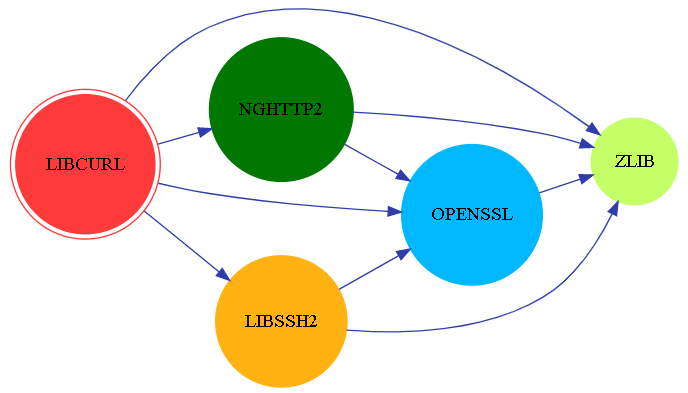
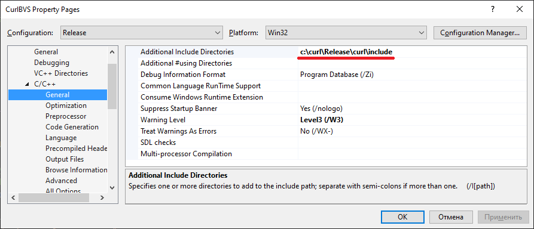
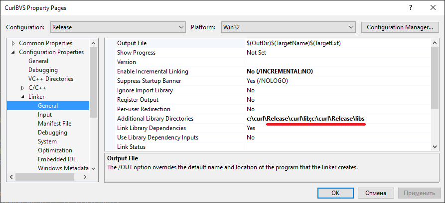
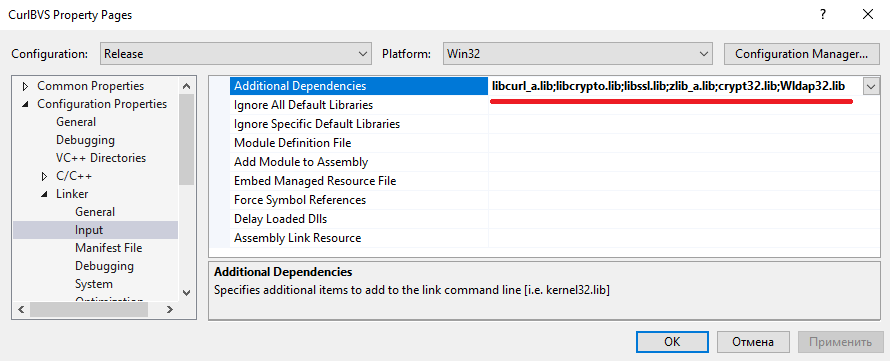

# Сборка библиотек Curl для встраивания в C++ приложения

Цель репозитария - подготовить библиотеку Curl для использования в приложениях на C++ для выполнения https-запросов с использованием самоподписанных сетификатов.

Целевая платформа: Microsoft Windows 7/10. Компиляторы: Visual Studio 2013 и 2019.

Преимущества **curllib**:

1. Приложение **curl** входит в состав операционной системы Microsoft Windows 10, что явно указывает на отсутствие каких-либо проблем совместимости с этой операционной системой
2. Собирается компиляторами Visual Studio 2013 (Boost.Beast требует Visaul Studio 2015 и выше)
3. Поддерживается огромное количество [протоколов](https://curl.se/docs/protdocs.html), включая:  HTTP/2, HTTP/3
4. Поддерживаются разные модели программирования: многопоточная (easy), однопоточная ассинхронная (multi), многопоточная асинхронная (multi)
5. Совместимость с IPv6
6. Поддержка разными операционными системами, включая [устаревшие](https://curl.se/libcurl/)

Недостатки:

1. Интерфейс программирования (API) - язык Си. В проекте С++ это приводит к стилистической фрагментации кода
2. Библиотека очень комплексная
3. Модель Easy, с высокой вероятностью, означает потребность в межпоточном взаимодействии, что ухудшает утилизацию вычислительных ресурсов и усложняет сопровождение кода

## Начальная точка

Библиотека curllib зависит от других библиотек, в частности от zlib и openSSL.



Инструкция по сборке **curllib.lib** подробно описана в файле "\winbuild\BUILD.WINDOWS.txt" исходных текстов, доступных в [официальном репозитарии](https://github.com/curl/curl). Загрузить исходники можно и с [официального сайта](https://curl.haxx.se/download.html).

Исходные тексты [openSSL](https://www.openssl.org/source/) могут быть загружены из официального Git-репозитария:

``` cmd
git clone git://git.openssl.org/openssl.git
```

Либо из зеркала на [GitHub](https://github.com/):

```  cmd
git clone https://github.com/openssl/openssl.git
```

Актуальные [исходные тексты zlib](http://www.zlib.net/) могут быть скачены из репозитария [GitHub от Madler - Mark Adler - соавтор zlib](https://github.com/madler/zlib).

## Настройка компилятора и системы сборки

Чтобы собрать curllib можно использовать Visual Studio Tools. Следует открыть консоль операционной системы и выполнить инициализацию системы сборки. Выбрать подходящую строку инициализации можно нажав кнопку "Старт" -> "Visual Studio 2013" -> "Visual Studio Tools" и выбрав соответствующий скрипт. Для x86 (32-бита) используется следующая строка инициализации:

``` cmd
%comspec% /k ""C:\Program Files (x86)\Microsoft Visual Studio 12.0\VC\vcvarsall.bat"" x86
```

Настройка переменных окружения для Visual Studio 2019 для native-компилятора x64 осуществляется командой:

``` cmd
%comspec% /k "C:\Program Files (x86)\Microsoft Visual Studio\2019\Community\VC\Auxiliary\Build\vcvars64.bat"
```

## Подготовка к сборке

Сборка curllib.lib в операционной системе Microsoft Windows осуществляется из папки "\winbuild\". В папке находится файл "BUILD.WINDOWS.txt" в котором описаны особенности сборки библиотеки. В частности указывается, что компоненты вспомогательных библиотек должны быть размещены в папке deps, находящейся на том же уровне, что и исходные тексты curl:

``` dir
   somedirectory\
    |_curl-src
    | |_winbuild
    |
    |_deps
      |_ lib
      |_ include
      |_ bin
```

Требование строгое - попытка разместить на одном уровне репозитарии openssl и zlib привела к ошибке сборки - файл "zlib.h" не был найден. Сама структура папок предполагает, что обе библиотеки также будут предварительно собраны.

## Сборка openSSL

Заметки о сборке библиотеки openSSL под Windows приведены в файле "NOTES.WIN". Также доступна [инструкция на Wiki](https://wiki.openssl.org/index.php/Compilation_and_Installation)

### Предварительные условия (Prerequisites)

Для сборки необходим Perl, т.к. выполняемый скрипт сборки продукта генерируется посредством Perl-скрипта. Разработчики openSSL рекомендуют использовать [Strawberry Perl](http://strawberryperl.com/), но этот инструмент включает, в том числе компилятор gcc. В качестве альтернативы предлагается использовать [ActiveState Perl](https://www.activestate.com/ActivePerl), который классифицируется как Enterprise-инструмент и для загрузки требует выполнить регистрацию и подписку на новости.

Фактически, для сборки был использован **Strawberry Perl**.

В дополнение к Perl, требуется установить [Netwide Assembler](https://www.nasm.us/) - компилятор **Assembler**-а для x86/x64. Для установки требуется запускать инсталлятор **NASM** с администраторскими привелегиями. 32-битная версия устанавливается в папку "c:\Program Files (x86)\NASM"

### Действия по сборке библиотек

Для успешной генерации скрипта сборки следует добавить в переменную %PATH% путь к компилятору NASM. Заметим, что NASM [доступен в исходных текстах на GitHub](https://github.com/netwide-assembler/nasm). Установить путь к NASM можно перед сборкой проекта командой: `set PATH=%PATH%;"c:\Program Files (x86)\NASM`

Генерация скрипта сборки осуществляется командой: `perl Configure VC-WIN64A` (для получения 64-битных библиотек) и `perl Configure VC-WIN32` (для генерации 32-битных библиотек). Чтобы собрать статическую версию библиотек, следует использовать дополнительный ключ `no-shared`

Если необходимо собрать DEBUG-версию, следует использовать ключ `--debug`. Для минимазации времени сборки, следует использовать ключ `no-tests` для отказать от сборки утилит для тестирования библиотек.

Утилита конфигурации допускает использования [дополнительных ключей](https://svn.python.org/projects/external/openssl-1.0.1e/Configure), включая threads/no-threads, zlib и zlib-dynamic.

Успешность формирования конфигурации подтверждается следующим тестовым сообщением в консоли:

``` log
**********************************************************************
***                                                                ***
***   OpenSSL has been successfully configured                     ***
***                                                                ***
```

Сборка библиотек осуществляется посредством команды `nmake`. Процесс сборки библиотек занимает около 30 минут на Intel Core i5 3xxx.

В соответствии с официальной инструкцией, после сборки следует выполнить команду `nmake test`, которая запускает unit-тесты. Команда `nmake install` позволяет выполнить развертывание компонентов openSSL (административных утилит) в операционной системе.

### Сборка на практике (июль 2022)

Следующая последовательность команд привела к успешной сборке openSSL:

``` cmd
git clone https://github.com/openssl/openssl.git
cd openssl
"c:\Program Files (x86)\NASM\nasmpath.bat" 
%comspec% /k "C:\Program Files (x86)\Microsoft Visual Studio 12.0\VC\vcvarsall.bat" x86
perl Configure VC-WIN32 no-shared
nmake
```

Заметим, что по умолчанию установлен флаг **no-zlib**.

### Результаты сборки

Результатами сборки являются статические и динамические библиотеки, размещённые в главном подкаталоге проекта.

Файлы, относящиеся к динамической линковке:

1. libcrypto.lib
2. libssl.lib
3. libcrypto-3.dll
4. libssl-3.dll

Файлы относящиеся к статической линковке:

1. libcrypto_static.lib
2. libssl_static.lib

Результаты сборки необходимо скопировать в папку "lib" внутри папки "openssl".  Это действие является критичным, т.к. скрипт сборки libcurl анализирует файлы в папке, указанной в параметре **SSL_PATH** и если там не будет файла "libssl.lib", то система будет считать, что ей следует выполнять линковку не с актуальными библиотеками openssl (libcrypto.lib, libssl.lib), а с устаревшими библиотеками версий 1.0.2 и ниже (libeay32.lib, ssleay32.lib). Для информации, скрипт сборки "MakefileBuild.vc" содержит вот такую строку:

``` bash
!IF "$(WITH_SSL)"=="dll" || "$(WITH_SSL)"=="static"
!IF EXISTS("$(SSL_LIB_DIR)\libssl.lib")
SSL_LIBS     = libssl.lib libcrypto.lib
!ELSE
SSL_LIBS     = libeay32.lib ssleay32.lib
!ENDIF
```

Стоит заметить, что папка include в openSSL уже есть.

## Сборка Zlib

Для сборки проекта под Microsoft Windows рекомендуется использовать подходящий solution из папки `\zlib\contrib\vstudio`. Доступны solution для **Visual Studio 2008-2015**.

Попытка собрать solution `\zlib\contrib\vstudio\vc12\zlibvc.sln` оказалась не успешной:

``` output
1>  crc32.c
1>..\..\..\crc32.c(1089): error C2708: 'crc32_combine64' : actual parameters length in bytes differs from previous call or reference
1>          ..\..\..\crc32.c(1072) : see declaration of 'crc32_combine64'
1>..\..\..\crc32.c(1106): error C2708: 'crc32_combine_gen64' : actual parameters length in bytes differs from previous call or reference
1>          ..\..\..\crc32.c(1093) : see declaration of 'crc32_combine_gen64'
1>..\..\..\crc32.c(1111): error C2373: 'crc32_combine_op' : redefinition; different type modifiers
1>          e:\sources\curlbuild\zlib\zlib.h(1768) : see declaration of 'crc32_combine_op'
```

В документации по zlib указано, что можно скачать заранее [собранные с ресурса](http://www.winimage.com/zLibDll)

Ещё один способ решения проблем со сборкой - использовать [решение австралийца Кельвина Ли](https://github.com/kiyolee/zlib-win-build). Так, например, для сборки Multithreading приложений средствами Visual Studio 2013 следует использовать solution `\zlib-win-build\build-VS2013-MT`

Сборка проектов libz и libz-static из исходников Кельвина Ли была успешна.

Следует заметить, что при сборке curl, собранные библиотеки и заголовочные файлы должны быть скопированы в папки 'deps/lib' и 'deps/include' соответственно.

Для успешной сборки Curl необходимо переименовать файл **zlibstat.lib** в **zlib_a.lib**.

## Сборка Curl

Перед началом сборки необходимо выполнить командный скрипт **buildconf.bat**. В числе прочего, этот скрипт сгенерирует файл **curl\src\tool_hugehelp.c**, без которого сборка не будет успешной.

Сборка curllib.lib осуществляется из папки "\winbuild\" следующей командой:

``` cmd
nmake /f Makefile.vc mode=static DEBUG=yes WITH_ZLIB=static 
  ZLIB_PATH=d:\Sources\deps 
  WITH_SSL=static SSL_PATH=d:\Sources\curl\openssl 
  ENABLE_SSPI=no ENABLE_IPV6=no ENABLE_IDN=no ENABLE_WINSSL=yes
```

Параметр "mode" определяет тип линковки (dll, статическая линковка). Флаг "DEBUG" позволяет указать, какую версию следует собирать (Debug/Release). Параметры WITH_ZLIB и ZLIB_PATH указывают на необходимость линковки **Zlib** и путь к исходникам. А параметры WITH_SSL и SSL_PATH - необходимость линковки **openSSL** и путь к исходникам.

[SSPI](https://en.wikipedia.org/wiki/Security_Support_Provider_Interface) это Security Support Provider Interface, интерфейс Microsoft Windows, который выполняет задачи аутентификации пользователей, в том числе, по протоколам NTLM, Kerberos. Чаще всего используется для доступа в сеть через Proxy-сервера. Указать на необходимость использования SSPI можно посредством флага ENABLE_SSPI. *Возможно, что этот флаг указывает на необходимость использования Schannel (из Windows SSPI), которая является нативной SSL библиотекой в Windows. Тем не менее, openSSL чаще всего используется как SSL backend в современных приложениях.*

Curl может работать не только по IPv4, но и по **IPv6**, что должно быть отражено в значении флага **ENABLE_IPV6**.

*Вероятно, опция **ENABLE_WINSSL** указывает на необходимость проверки отзыва сертификатов, при https-соединении, если значение флага установлено в **yes**.

Флаг **ENABLE_IDN** указывает на необходимость поддержки IDN - international domain names, т.е. имён ресурсов на национальных языках.

Дополнительные параметры ENABLE_SSPI, ENABLE_IPV6 и ENABLE_WINSSL, по умолчанию, установлены в **yes** - этот фактор следует учитывать при сборке приложения.

Результат сборки находится в папке: **\curl\builds**.

## Параметры сборки приложений

Настройки пути к include-файлам:



В случае, если curllib.lib была собрана как статическая библиотека, необходимо определить в проекте директиву **CURL_STATICLIB**:


Настройка пути к включаемым библиотекам:



Список подключаемых библиотек (libcurl_a.lib;libcrypto.lib;libssl.lib;zlib_a.lib;crypt32.lib;Wldap32.lib;ws2_32.lib):



### Потенциальные проблемы при сборке MFC-приложений с curl

При сборке приложения могут возникнуть следующие проблемы:

``` log
1>MSVCRT.lib(MSVCR120.dll) : error LNK2005: _strchr already defined in libcmt.lib(strchr.obj)
1>MSVCRT.lib(MSVCR120.dll) : error LNK2005: _strncpy already defined in libcmt.lib(strncpy.obj)
```

Вероятная причина проблемы - библиотеки были собраны в модели "без MFC", а основное приложение - в модели "с MFC".

Всего в Visual Studio используются четыре модели:

- **libcmt.lib**: static CRT link library for a release build (/MT)
- **libcmtd.lib**: static CRT link library for a debug build (/MTd)
- **msvcrt.lib**: import library for the release DLL version of the CRT (/MD)
- **msvcrtd.lib**: import library for the debug DLL version of the CRT (/MDd)

В случае, если собирается консольное приложение без MFC, компиляция завершается корректно. Единственный нюанс - при загрузке ресурса в корпоративной сети КБ ДОРС, необходимо явным образом указывать proxy-сервер, либо переходить на ресурс, размещённый в корпоративной сети.

Чтобы задавить различия в используемых runtime-ах, можно использовать совет, [найденный в интернет](https://stackoverflow.com/questions/15919435/include-curl-in-mfc-project):

``` text
By default, curl compiles with the /MD (dll) run-time library (that's why you get the __imp__ prefix to the unresolved externals).

I assume you build your MFC project with /MT (statically linked run-time).

You can build curl with static run-time by setting the RTLIBCFG environment variable in your build console to static, like this:

set RTLIBCFG=static

Or just add manually /MT to the compiler flags and /NODEFAULTLIB:MSVCRT.lib to the link flags in the makefiles, in case the first suggestion doesn't work.
```

Если задавить статическую CRT-библиотку ключём сборки `/NODEFAULTLIB:libcmt.lib`, то при сборке MFC-приложения может возникнуть ошибка:

``` output
error LNK2001: unresolved external symbol ___argc
error LNK2001: unresolved external symbol ___wargv
```

Ошибка устраняется установкой режима использования MFC "Use MFC in a Shared DLL".

## Примеры кода

Множество примеров кода доступно [по ссылке на официальном сайте](https://curl.haxx.se/libcurl/c/example.html). Типовой пример:

```cpp
#include <iostream>
#include "curl/curl.h"

int main(void)
{
	CURL *curl;
	CURLcode result;

	curl_global_init(CURL_GLOBAL_DEFAULT);
	curl = curl_easy_init();
	if (curl) {
		curl_easy_setopt(curl, CURLOPT_URL, "http://www.example.com/");   // Set URL
		
		// If you want to set any more options, do it here, before making the request.
		// Perform the request which prints to stdout
		result = curl_easy_perform(curl);
		// Error check
		if (result != CURLE_OK) {
			std::cerr << "Error during curl request: " 
				<< curl_easy_strerror(result) << std::endl;
		}
		
		curl_easy_cleanup(curl);
		
	} else {
		std::cerr << "Error initializing curl." << std::endl;
	}

	curl_global_cleanup();
	return 0;
	}
```

Простейший вариант использования https (без аутентификации host-а и peer-а):

```cpp
curl_easy_setopt(curl, CURLOPT_URL, "https://www.google.com/");
curl_easy_setopt(curl, CURLOPT_SSL_VERIFYPEER, 0L);
curl_easy_setopt(curl, CURLOPT_SSL_VERIFYHOST, 0L);
result = curl_easy_perform(curl);
```

Проверка имени хоста в сертификате осуществляется, если установить следующий флаг:

```cpp
curl_easy_setopt(curl, CURLOPT_SSL_VERIFYHOST, 2L);
```

Использование клиентского сертификата в SSL-соединении есть в [примере simplessl](https://curl.haxx.se/libcurl/c/simplessl.html). См.:

```cpp
/* set the cert for client authentication */ 
curl_easy_setopt(curl, CURLOPT_SSLCERT, pCertFile);
```

Выполнение аутентификации сервера с использованием самоподписанного сертификата, хранимого на клиенте можно увидеть в [примере cacertinmem](https://curl.haxx.se/libcurl/c/cacertinmem.html). См.:

```cpp
/* set the file with the certs vaildating the server */ 
curl_easy_setopt(curl, CURLOPT_CAINFO, pCACertFile);
```

### Получить данные от сервера. Пример

Сначала требуется разработать функцию накопления возвращаемых результатов:

``` cpp
size_t CurlWrite_CallbackFunc_StdString(void *contents, size_t size, size_t nmemb, std::string *s)
{
	size_t newLength = size*nmemb;
	try
	{
		s->append((char*)contents, newLength);
	}
	catch (std::bad_alloc &e)
	{
		//handle memory problem
		return 0;
	}
	return newLength;
}
```

Далее эту функцию можно применить, указав в качестве накопителя информации std::string:

``` cpp
std::string s;

CURL *curl;
CURLcode result;

curl_global_init(CURL_GLOBAL_DEFAULT);
curl = curl_easy_init();
if (curl) {
	curl_easy_setopt(curl, CURLOPT_URL, "http://127.0.0.1:3000/");   // Set URL

	// If you want to set any more options, do it here, before making the request.
	// Perform the request which prints to stdout

	curl_easy_setopt(curl, CURLOPT_WRITEFUNCTION, CurlWrite_CallbackFunc_StdString);
	curl_easy_setopt(curl, CURLOPT_WRITEDATA, &s);

	result = curl_easy_perform(curl);
	...
	curl_easy_cleanup(curl);
```

Вывод сообщения в MFC-приложении:

``` cpp
::AfxMessageBox(s.c_str(), MB_OK);
```

## Дополнительные замечания

Важное замечание: в случае, если curllib.lib была собрана как статическая библиотека, необходимо определить в проекте define **CURL_STATICLIB**.

Состав линкуемых библиотек должен быть таким:

1. \curl\libcurl.lib - реализация сетевых протоколов (HTTP/HTTPS/FTP и т.д.)
2. \zlib\zlib.lib - упаковка/распаковка архивов
3. \openssl\libcrypto.lib, \openssl\libssl.lib - реализация криптографических алгоритмов
4. ws2_32.lib - TCP/IP
5. crypt32.lib - доступ к сертификатам Windows
6. Wldap32.lib - LDAP API, доменная аутентификация (если нужно в рамках проекта)

Рахождение c инструкцией от [Peter Rekdal Sunde](https://github.com/peters): он включает библиотеку wsock32.lib, но не включает crypt32.lib.

## Дополнительные ссылки

Разработка [скрипта сборки под Windows](buildscript.md).

[Похожую инструкцию](https://github.com/peters/curl-for-windows) по сборке Curl разработал Peter Rekdal Sunde.

[Сравнение кода](pem.md) проверки сертификатов сервера в приложениях с использованием curllib, boost.beast, Android-приложении и C#-коде.

Для тестирования кода, использующего различные сертификаты можно использовать сайт [badssl](https://badssl.com/).
