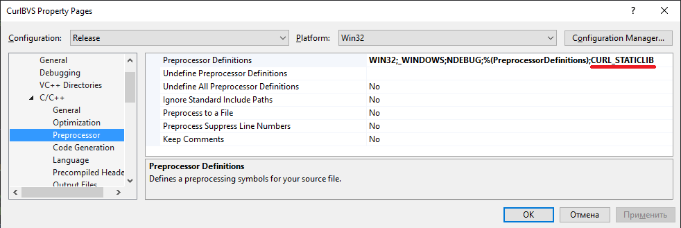

# Сборка библиотек Curl для встраивания в C++ приложения

Цель репозитария - подготовить библиотеку Curl для использования в приложениях на C++ для выполнения https-запросов с использованием самоподписанных сетификатов.

Целевая платформа: Microsoft Windows 7/10. Компиляторы: Visual Studio 2013 и 2019.

Преимущества **curllib**:

1. Приложение **curl** входит в состав операционной системы Microsoft Windows 10, что явно указывает на отсутствие каких-либо проблем совместимости с этой операционной системой
2. Собирается компиляторами Visual Studio 2013 (Boost.Beast требует Visaul Studio 2015 и выше)
3. Поддерживается огромное количество [протоколов](https://curl.se/docs/protdocs.html), включая: HTTP/2, HTTP/3
4. Поддерживаются разные модели программирования: многопоточная (easy), однопоточная ассинхронная (multi), многопоточная асинхронная (multi)
5. Совместимость с IPv6
6. Поддержка разных операционных системам, включая [устаревшие](https://curl.se/libcurl/)

Недостатки:

1. Интерфейс программирования (API) - язык Си. В проекте С++ это приводит к стилистической фрагментации кода
2. Библиотека очень комплексная
3. Модель Easy, с высокой вероятностью, означает потребность в межпоточном взаимодействии, что ухудшает утилизацию вычислительных ресурсов и усложняет сопровождение кода
4. Сообщения об ошибках - только на английском языке. Для обеспечения интернационализации, необходимо перевести на целевой язык [около 100 сообщений](https://curl.se/libcurl/c/libcurl-errors.html)

**Update 2024 года**: в число рассматриваемых библиотек, кроме curllib и boost.beast, также имеет смысл рассматривать [POCO C++ Libraries](https://pocoproject.org/). Эта библиотека является кросс-платформенной, интернет-центричной. Кроме сетевого взаимодействия, библиотека содержит реализацию адаптеров к популярным СУБД, в частности: ODBC, MySQL, SQLite. Для работы с СУБД может быть также интересной библиотека [Soci](https://soci.sourceforge.net/).

## Начальная точка (где взять исходные тексты библиотек)

Библиотека curllib зависит от других библиотек, в частности от zlib и openSSL.


Инструкция по сборке **curllib.lib** подробно описана в файле "\winbuild\BUILD.WINDOWS.txt" исходных текстов, доступных в [официальном репозитарии](https://github.com/curl/curl). Загрузить исходники можно и с [официального сайта](https://curl.haxx.se/download.html).

Исходные тексты [openSSL](https://www.openssl.org/source/) могут быть загружены из официального Git-репозитария: `git clone git://git.openssl.org/openssl.git`, либо из зеркала на [GitHub](https://github.com/): `git clone https://github.com/openssl/openssl.git`

Актуальные [исходные тексты zlib](http://www.zlib.net/) могут быть скачены из репозитария [GitHub от Madler - Mark Adler - соавтор zlib](https://github.com/madler/zlib).

## Особенности работы в корпоративных сетях

В корпоративных сетях почти всегда используются прокси-сервера, в задачи которых входят:

- единая точка контроля обмена трафиком, в том числе, для идентификации зловредов и вирусов
- кэширование http-трафика
- блокировка доступа к запрещённым и развлекательным сайтам
- контроль использования Интернет конкретными пользователями

Доступ к прокси-серверу почти в 100% случаев требует аутентификации пользователя. В 2024 году прокси-сервера были массово интегрированы с **Active Directory**, что позволяет снизить нагрузку на пользователей системы и не передавать логин/пароль доступа сторонным приложениям. Для приложения это означает, что оно не должно хранить данных пользователя - они будут "подтянуты" автоматически. Важным является только получение корректного адреса прокси-сервера.

Побочный эффект от использования прокси-сервера - он может быть устаревшим и не поддерживать современные TLS. Например, браузер пользователя может поддерживать TLS 1.3, но прокси-сервер поддерживает только TLS 1.1., что будет приводить к проблемам работы с серверами, у которых поддержка TLS 1.1 была запрещена.

## Настройка компилятора и системы сборки

Для сборки curllib можно использовать Visual Studio Tools. Поскольку сборка осуществляется, преимущественно, из командной строки, следует выполнить инициализацию системы сборки. Выбрать подходящую строку инициализации можно нажав кнопку "Старт" -> "Visual Studio 2013" -> "Visual Studio Tools" и выбрав соответствующий скрипт. Для Visual Studio 2013 и x86 (32-бита) используется следующая строка инициализации:

``` cmd
%comspec% /k ""C:\Program Files (x86)\Microsoft Visual Studio 12.0\VC\vcvarsall.bat"" x86
```

Настройка переменных окружения для Visual Studio 2019 для native-компилятора x64 осуществляется командой:

``` cmd
%comspec% /k "C:\Program Files (x86)\Microsoft Visual Studio\2019\Community\VC\Auxiliary\Build\vcvars64.bat"
```

## Подготовка к сборке

Сборка curllib.lib в операционной системе Microsoft Windows осуществляется из папки "\winbuild\". Особенности сборки библиотеки описаны в файле "BUILD.WINDOWS.txt". В частности указывается, что компоненты вспомогательных библиотек должны быть размещены в папке deps, находящейся на том же уровне, что и исходные тексты curl:

``` dir
   somedirectory\
    |_curl-src
    | |_winbuild
    |
    |_deps
      |_ lib
      |_ include
      |_ bin
```

Требование строгое - попытка разместить на одном уровне репозитарии openssl и zlib привела к ошибке сборки - файл "zlib.h" не был найден. Сама структура папок предполагает, что обе библиотеки также будут предварительно собраны.

## Сборка openSSL

Заметки о сборке библиотеки openSSL под Windows приведены в файле "NOTES.WIN". Также доступна [инструкция на Wiki](https://wiki.openssl.org/index.php/Compilation_and_Installation)

### Предварительные условия (Prerequisites)

Для сборки необходим Perl, т.к. выполняемый скрипт сборки продукта генерируется посредством Perl-скрипта. Разработчики openSSL рекомендуют использовать [Strawberry Perl](http://strawberryperl.com/), но этот инструмент включает, в том числе компилятор gcc. В качестве альтернативы предлагается использовать [ActiveState Perl](https://www.activestate.com/ActivePerl), который классифицируется как Enterprise-инструмент и для загрузки требует выполнить регистрацию и подписку на новости.

Фактически, для сборки был использован **Strawberry Perl**.

В дополнение к Perl, требуется установить [Netwide Assembler](https://www.nasm.us/) - компилятор **Assembler**-а для x86/x64. Для установки требуется запускать инсталлятор **NASM** с администраторскими привелегиями. 32-битная версия устанавливается в папку "c:\Program Files (x86)\NASM"

### Действия по сборке библиотек

Для успешной генерации скрипта сборки следует добавить в переменную %PATH% путь к компилятору NASM. Заметим, что NASM [доступен в исходных текстах на GitHub](https://github.com/netwide-assembler/nasm). Установить путь к NASM можно перед сборкой проекта командой: `set PATH=%PATH%;"c:\Program Files (x86)\NASM`

Генерация скрипта сборки осуществляется командой: `perl Configure VC-WIN64A` (для получения 64-битных библиотек) и `perl Configure VC-WIN32` (для генерации 32-битных библиотек). Чтобы собрать статическую версию библиотек, следует использовать дополнительный ключ `no-shared`

 Если необходимо собрать DEBUG-версию, следует использовать ключ `--debug`. Для минимизации времени сборки, следует использовать ключ `no-tests` для отказать от сборки утилит для тестирования библиотек.

Утилита конфигурации допускает использования [дополнительных ключей](https://svn.python.org/projects/external/openssl-1.0.1e/Configure), включая threads/no-threads, zlib и zlib-dynamic. Заметим, что по умолчанию установлен флаг **no-zlib**. При использовании флага zlib, следует так же установить флаги: --with-zlib-include=[path to zlib headers] --with-zlib-lib=[path to zlib static library]

Ценность включения zlib - допускается сжатие передаваемых данных, что снижает трафик в 2-3 раза.

Успешность формирования конфигурации подтверждается следующим тестовым сообщением в консоли:

``` log
**********************************************************************
***                                                                ***
***   OpenSSL has been successfully configured                     ***
***                                                                ***
```

Сборка библиотек осуществляется посредством команды `nmake`. Процесс сборки библиотек занимает около 30 минут на Intel Core i5 3xxx.

В соответствии с официальной инструкцией, после сборки следует выполнить команду `nmake test`, которая запускает unit-тесты. Команда `nmake install` позволяет выполнить развертывание компонентов openSSL (административных утилит) в операционной системе.

### Сборка на практике (июль 2022)

На диске "e" была создана папка "e:\curlsrc", в которой созданы подпапки "curl" и "deps".

## Шаг 1 - Сборка Zlib

Для сборки проекта под Microsoft Windows рекомендуется использовать подходящий solution из папки `\zlib\contrib\vstudio`. Доступны solution для **Visual Studio 2008-2015**. Однако, попытка собрать solution `\zlib\contrib\vstudio\vc12\zlibvc.sln` оказалась не успешной:

``` output
1>  crc32.c
1>..\..\..\crc32.c(1089): error C2708: 'crc32_combine64' : actual parameters length in bytes differs from previous call or reference
1>          ..\..\..\crc32.c(1072) : see declaration of 'crc32_combine64'
1>..\..\..\crc32.c(1106): error C2708: 'crc32_combine_gen64' : actual parameters length in bytes differs from previous call or reference
1>          ..\..\..\crc32.c(1093) : see declaration of 'crc32_combine_gen64'
1>..\..\..\crc32.c(1111): error C2373: 'crc32_combine_op' : redefinition; different type modifiers
1>          e:\sources\curlbuild\zlib\zlib.h(1768) : see declaration of 'crc32_combine_op'
```

В документации по zlib указано, что можно скачать заранее [собранные файлы с ресурса](http://www.winimage.com/zLibDll)

Ещё один способ решения проблем со сборкой - использовать [решение австралийца Кельвина Ли](https://github.com/kiyolee/zlib-win-build). Так, например, для сборки Multithreading приложений средствами Visual Studio 2013 следует использовать solution `\zlib-win-build\build-VS2013-MT`

Сборка проектов libz и libz-static из исходников Кельвина Ли была успешна. Библиотеки и заголовочные файлы были скопированы в папки 'deps/lib' и 'deps/include' соответственно.

Для успешной сборки Curl необходимо переименовать файл **zlibstat.lib** в **zlib_a.lib**.

**Update 2023 October**: для ускорения операций может быть использована реализация с ассемблерными вставками (см. ключи **ASMV** и **ASMINF**). При смешивании режимов сборки проектов в рамках solution-а могут возникнуть проблемы сборки. Например, какой-то проект использует boost с интегированным zlib без ассемблерного кода, а какой-то проект использует заголовочный файлы, ожидания, что при линковке будет использоваться вариант с ассемблерными вставками. На эту особенность zlib следует обратить внимание - на практике, мы с подобными проблемами сталкивались.

## Шаг 2 - Сборка openSSL

Следующая последовательность команд привела к успешной сборке openSSL:

``` cmd
git clone https://github.com/openssl/openssl.git
git checkout openssl-3.0
cd openssl
"c:\Program Files (x86)\NASM\nasmpath.bat"
%comspec% /k "C:\Program Files (x86)\Microsoft Visual Studio 12.0\VC\vcvarsall.bat" x86
perl Configure VC-WIN32 no-shared no-tests
nmake
```

Для проверки того, что из репозитария извлечена промышленная, а не developer-сборка, может быть использована команда: `git branch`

Загрузка репозитария осуществляется 5-10 минут, а сборка openSSL занимает около 30 минут.

Команда сборка DEBUG-библиотеки:

``` cmd
perl Configure VC-WIN32 no-shared no-tests --debug
```

### Ошибка сборки openssl 3.0.1-dev с zlib

Следует заметить, что если скрипт сборки был сгенерирован следующей ниже командой, то сборка разваливалась с ошибкой:

``` shell
perl Configure VC-WIN32 no-shared no-tests zlib --with-zlib-include=e:/curlsrc/deps/include --with-zlib-lib=e:/curlsrc/deps/lib
```

Выводилась следующая ошибка:

``` output
cmd /C ""link" /nologo /debug /dll  /nologo /debug @C:\Users\M2DFC~1.ROZ\AppData\Local\Temp\nm6D48.tmp || (DEL /Q legacy.* providers\legacy.* & EXIT 1)"
LINK : fatal error LNK1104: cannot open file 'e:\curlsrc\deps\lib.obj'
Не удается найти e:\curlsrc\openssl\legacy.*
NMAKE : fatal error U1077: 'cmd' : return code '0x1'
Stop.
NMAKE : fatal error U1077: '"C:\Program Files (x86)\Microsoft Visual Studio 12.0\VC\BIN\nmake.exe"' : return code '0x2'
Stop.
```

При этом, файлы libcrypto.lib и libssl.lib были собраны и находились в папке `e:\curlsrc\openssl`.

Однако, было принято временное решение собирать openssl без zlib.

### Результаты сборки

Результатами сборки являются статические и динамические библиотеки, размещённые в главном подкаталоге проекта.

Файлы, относящиеся к динамической линковке:

1. libcrypto.lib
2. libssl.lib
3. libcrypto-3.dll
4. libssl-3.dll

Файлы относящиеся к статической линковке:

1. libcrypto_static.lib
2. libssl_static.lib

Результаты сборки необходимо скопировать в папку "lib" внутри папки "openssl". Это действие является критичным, т.к. скрипт сборки libcurl анализирует файлы в папке, указанной в параметре **SSL_PATH** и если там не будет файла "libssl.lib", то система будет считать, что ей следует выполнять линковку не с актуальными библиотеками openssl (libcrypto.lib, libssl.lib), а с устаревшими библиотеками версий 1.0.2 и ниже (libeay32.lib, ssleay32.lib). Для информации, скрипт сборки "MakefileBuild.vc" содержит вот такую строку:

``` bash
!IF "$(WITH_SSL)"=="dll" || "$(WITH_SSL)"=="static"
!IF EXISTS("$(SSL_LIB_DIR)\libssl.lib")
SSL_LIBS     = libssl.lib libcrypto.lib
!ELSE
SSL_LIBS     = libeay32.lib ssleay32.lib
!ENDIF
```

Стоит заметить, что папка include в openSSL уже есть.

## Шаг 3 - Сборка Curl

Исходные тексты были загружена командой `git clone https://github.com/curl/curl`

Перед началом сборки необходимо выполнить командный скрипт **buildconf.bat**. В числе прочего, этот скрипт сгенерирует файл **curl\src\tool_hugehelp.c**, без которого сборка не будет успешной.

Сборка curllib.lib осуществляется из папки "\winbuild\" следующей командой:

``` cmd
nmake /f Makefile.vc mode=static DEBUG=no WITH_ZLIB=static ZLIB_PATH=e:\curlsrc\deps WITH_SSL=static SSL_PATH=e:\curlsrc\openssl ENABLE_SSPI=yes ENABLE_IPV6=no ENABLE_IDN=no ENABLE_WINSSL=yes
```

Параметр "mode" определяет тип линковки (dll, статическая линковка). Флаг "DEBUG" позволяет указать, какую версию следует собирать (Debug/Release). Параметры WITH_ZLIB и ZLIB_PATH указывают на необходимость линковки **Zlib** и путь к исходникам. А параметры WITH_SSL и SSL_PATH - необходимость линковки **openSSL** и путь к исходникам.

[SSPI](https://en.wikipedia.org/wiki/Security_Support_Provider_Interface) это Security Support Provider Interface, интерфейс Microsoft Windows, который выполняет задачи аутентификации пользователей, в том числе, по протоколам NTLM, Kerberos. Чаще всего используется для доступа в сеть через Proxy-сервера. Указать на необходимость использования SSPI можно посредством флага ENABLE_SSPI. *Возможно, что этот флаг указывает на необходимость использования Schannel (из Windows SSPI), которая является нативной SSL библиотекой в Windows. Тем не менее, openSSL чаще всего используется как SSL backend в современных приложениях.*

Curl может работать не только по IPv4, но и по **IPv6**, что должно быть отражено в значении флага **ENABLE_IPV6**.

*Вероятно, опция **ENABLE_WINSSL** указывает на необходимость проверки отзыва сертификатов, при https-соединении, если значение флага установлено в **yes**.

Флаг **ENABLE_IDN** указывает на необходимость поддержки IDN - international domain names, т.е. имён ресурсов на национальных языках.

Дополнительные параметры ENABLE_SSPI, ENABLE_IPV6 и ENABLE_WINSSL, по умолчанию, установлены в **yes** - этот фактор следует учитывать при сборке приложения.

Результат сборки находится в папке: **\curl\builds**.

## Параметры сборки приложений

Настройки пути к include-файлам:


В случае, если curllib.lib была собрана как статическая библиотека, необходимо определить в проекте директиву **CURL_STATICLIB**:



Настройка пути к включаемым библиотекам:


Список подключаемых библиотек (libcurl_a.lib;libcrypto.lib;libssl.lib;zlib_a.lib;crypt32.lib;Wldap32.lib;ws2_32.lib):


## Дополнительные замечания

Важное замечание: в случае, если curllib.lib была собрана как статическая библиотека, необходимо определить в проекте define **CURL_STATICLIB**.

Состав линкуемых библиотек должен быть таким:

1. \curl\libcurl.lib - реализация сетевых протоколов (HTTP/HTTPS/FTP и т.д.)
2. \zlib\zlib.lib - упаковка/распаковка архивов
3. \openssl\libcrypto.lib, \openssl\libssl.lib - реализация криптографических алгоритмов
4. ws2_32.lib - TCP/IP
5. crypt32.lib - доступ к сертификатам Windows
6. Wldap32.lib - LDAP API, доменная аутентификация (если нужно в рамках проекта)

Рахождение c инструкцией от [Peter Rekdal Sunde](https://github.com/peters): он включает библиотеку wsock32.lib, но не включает crypt32.lib.

## Дополнительные ссылки

Разработка [скрипта сборки под Windows](buildscript.md).

[Похожую инструкцию](https://github.com/peters/curl-for-windows) по сборке Curl разработал Peter Rekdal Sunde.

[Сравнение кода](pem.md) проверки сертификатов сервера в приложениях с использованием curllib, boost.beast, Android-приложении и C#-коде.

Для тестирования кода, использующего различные сертификаты можно использовать сайт [badssl](https://badssl.com/).

[Настройка IIS](./configureIIS.md) для проверки клиентского сертификата.

[Генерация сертификата](./request_cert.md) в инфраструктуре PKI.

[Инструкция](./clientCert.md) об использовании клиентского сертификата в клиентских приложениях.
