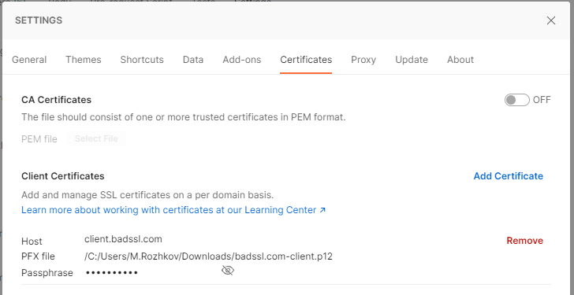

# Использование клиентского сертификата

Включение клиентского сертификата в процедуру установки соединения (handshake) позволяет обеспечить двух-стороннюю аутентификацию.

Для поддержки аутентификации клиента необходим private key (.key) клиента и его сертификат (.crt). Часто обе составляющие части объединяют в контейнер (.pem, или .pfx/.p12). Для проверки клиента сервер генерирует случайное значение (Challenge), который клиент подписывает своим private key и возвращает серверу Thumbprint.

Проверку клиентского кода можно осуществлять используя ресурс [badssl](https://badssl.com). В разделе [Client Certificate](https://badssl.com/download/) можно загрузить корректные клиентские сертификаты. Далее клиент может подключиться к ресурсу https://client.badssl.com и предъявить этот сертификат. Если клиентский код написан корректно, то сервер выполнит аутентификацию клиента и вернёт ответ с Http Status Code равным 200 (OK).

До разработки полноценного клиентского кода рекомендуется выполнить проверку соединения используя утилиты [Postman](https://www.postman.com/), или [curl](https://curl.se/).

## Postman

Для выполнения запроса с аутентификацией клиента необходимо указать клиентский сертификат в Settings -> Certificate. Для подключения к badssl требуется указать файл "badssl.com-client.p12", host - "client.badssl.com", а также пароль "badssl.com". Пример настройки:



Запрос к сайту должен выглядеть следующим образом: https://client.badssl.com

При работе в корпоративной сети с прокси, необходимо настроить подключение в Settings -> Proxy.

## Curl

Ещё один вариант проверки схемы без разработки клиентского кода - использовать утилиту Curl. Следует иметь ввиду, что curl может быть собран как с openssl, так и без этой библиотеки. Использование сборки с openssl является критичным.

Команда подключения к client.badssl.com из корпоративной сети через прокси может выглядеть так:

``` shell
curl -v -i -k --cert badssl.com‐client.pem:badssl.com -x 192.168.100.200:3128 https://client.badssl.com
```

Параметры команды:

По сравнению с текстом статьи, я указал корпоративный прокси. Параметры:

- -E, --cert [используемый сертификат:пароль]
- -v, --verbose необходима подробная информация
- -i, --include выводить информацию о MIME-заголовках
- -k, --insecure по умолчанию, curl проверяет соединение на безопасность. Этот ключ отключает проверку.
- -x использовать прокси-сервер

Ключевая особенность curl состоит в том, что в verbose-режиме осуществляется очень подробное протоколирование процесса подключения к серверу. Пример лога:

``` log
* CONNECT phase completed
* ALPN: offers h2
* ALPN: offers http/1.1
* TLSv1.0 (OUT), TLS header, Certificate Status (22):
* TLSv1.3 (OUT), TLS handshake, Client hello (1):
* TLSv1.2 (IN), TLS header, Certificate Status (22):
* TLSv1.3 (IN), TLS handshake, Server hello (2):
* TLSv1.2 (IN), TLS header, Certificate Status (22):
* TLSv1.2 (IN), TLS handshake, Certificate (11):
* TLSv1.2 (IN), TLS header, Certificate Status (22):
* TLSv1.2 (IN), TLS handshake, Server key exchange (12):
* TLSv1.2 (IN), TLS header, Certificate Status (22):
* TLSv1.2 (IN), TLS handshake, Request CERT (13):
* TLSv1.2 (IN), TLS handshake, Server finished (14):
* TLSv1.2 (OUT), TLS header, Certificate Status (22):
* TLSv1.2 (OUT), TLS handshake, Certificate (11):
* TLSv1.2 (OUT), TLS header, Certificate Status (22):
* TLSv1.2 (OUT), TLS handshake, Client key exchange (16):
* TLSv1.2 (OUT), TLS header, Certificate Status (22):
* TLSv1.2 (OUT), TLS handshake, CERT verify (15):
* TLSv1.2 (OUT), TLS header, Finished (20):
* TLSv1.2 (OUT), TLS change cipher, Change cipher spec (1):
* TLSv1.2 (OUT), TLS header, Certificate Status (22):
* TLSv1.2 (OUT), TLS handshake, Finished (20):
* TLSv1.2 (IN), TLS header, Finished (20):
* TLSv1.2 (IN), TLS header, Certificate Status (22):
* TLSv1.2 (IN), TLS handshake, Finished (20):
* SSL connection using TLSv1.2 / ECDHE-RSA-AES128-GCM-SHA256
* ALPN: server accepted http/1.1
* Server certificate:
*  subject: CN=*.badssl.com
*  start date: Aug 12 14:57:46 2022 GMT
*  expire date: Nov 10 14:57:45 2022 GMT
*  issuer: C=US; O=Let's Encrypt; CN=R3
*  SSL certificate verify result: unable to get local issuer certificate (20), continuing anyway.
* TLSv1.2 (OUT), TLS header, Supplemental data (23):
> GET / HTTP/1.1
> Host: client.badssl.com
> User-Agent: curl/7.84.0
> Accept: */*
```

## Пример клиентского кода на C\#

Ниже приведён пример приложения на C#, который отправляет клиентский сертификат на сервер badssl.com:

``` csharp
using System.Net;
using System.Security.Cryptography.X509Certificates;

// Для доступа к сайтам в интернет, необходимо указать Proxy
var proxy = new WebProxy
{
    Address = new Uri($"http://192.168.100.200:3128"),
    BypassProxyOnLocal = false,
    UseDefaultCredentials = true,
};

// Указываем, что следует идти через прокси
var handler = new HttpClientHandler()
{
    Proxy = proxy,
};

// Добавляем клиентский сертификат, который был нам предоставлен сайтом badssl.com
var cert = new X509Certificate2("c:/Temp/badssl.com-client.p12", "badssl.com");
handler.ClientCertificates.Add(cert);

var client = new HttpClient(handler);

// Описываем запрос по https
var request = new HttpRequestMessage()
{
    RequestUri = new Uri("https://client.badssl.com"),
    Method = HttpMethod.Get,
};

// Выполняем запрос 
var response = await client.SendAsync(request);
if (response.IsSuccessStatusCode)
{
    var responseContent = response.Content.ReadAsStream();
    Console.WriteLine(new StreamReader(responseContent).ReadToEnd());
}
```
