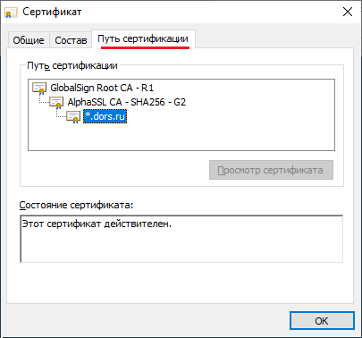

# Код приложений, использующий curl

Множество примеров кода доступно [по ссылке на официальном сайте](https://curl.haxx.se/libcurl/c/example.html). Типовой пример:

```cpp
#include <iostream>
#include "curl/curl.h"

int main(void)
{
	CURL *curl;
	CURLcode result;

	curl_global_init(CURL_GLOBAL_DEFAULT);
	curl = curl_easy_init();
	if (curl) {
		curl_easy_setopt(curl, CURLOPT_URL, "http://www.example.com/");   // Set URL
		
		// If you want to set any more options, do it here, before making the request.
		// Perform the request which prints to stdout
		result = curl_easy_perform(curl);
		// Error check
		if (result != CURLE_OK) {
			std::cerr << "Error during curl request: " 
				<< curl_easy_strerror(result) << std::endl;
		}
		
		curl_easy_cleanup(curl);
		
	} else {
		std::cerr << "Error initializing curl." << std::endl;
	}

	curl_global_cleanup();
	return 0;
	}
```

Простейший вариант использования https (без аутентификации host-а и peer-а):

```cpp
curl_easy_setopt(curl, CURLOPT_URL, "https://www.google.com/");
curl_easy_setopt(curl, CURLOPT_SSL_VERIFYPEER, 0L);
curl_easy_setopt(curl, CURLOPT_SSL_VERIFYHOST, 0L);
result = curl_easy_perform(curl);
```

Получить Http Status Codes можно после успешного вызова curl_easy_perform() используя функцию curl_easy_getinfo():

```cpp
CURLcode result = curl_easy_perform(curl);
if (result == CURLE_OK) {
	long http_code = 0;
	curl_easy_getinfo(curl, CURLINFO_RESPONSE_CODE, &http_code);
	if (http_code >= 400) { // Обрабатываем Http Status Codes
```

Библиотека libcurl позволяет устанавливать тайм-аут как на установление соединения с сервером, так и на общее время загрузки данных:

```cpp
// Устанавливаем ограничение на время подключения к серверу составляет 15 секунд
curl_easy_setopt(curl, CURLOPT_CONNECTTIMEOUT, 15L);

// Устанавливаем тайм-аут на выполнение операции в 2 минуты. У заказчиков в Африке 
// может быть очень медленный интернет
curl_easy_setopt(curl, CURLOPT_TIMEOUT, 120L);
```

Указать адрес proxy-сервера можно следующим образом:

```cpp
// Получаем адрес прокси-сервера
WINHTTP_CURRENT_USER_IE_PROXY_CONFIG pProxyConfig;
pProxyConfig.fAutoDetect = true;
BOOL bHasProxy = WinHttpGetIEProxyConfigForCurrentUser(&pProxyConfig);
if (bHasProxy && pProxyConfig.lpszProxy != NULL) {
	m_strProxy = pProxyConfig.lpszProxy;
}
...
if (!m_strProxy.empty()) {
	curl_easy_setopt(curl, CURLOPT_PROXY, converter.to_bytes(m_strProxy).c_str());
}
```

При считывании системных параметров прокси-сервера следует учитывать исключения (lpszProxyBypass). Если искомый домен находится в исключениях, то следует не устанавливать подключение через прокси:

``` cpp
WINHTTP_CURRENT_USER_IE_PROXY_CONFIG pProxyConfig;
pProxyConfig.fAutoDetect = true;
BOOL bHasProxy = WinHttpGetIEProxyConfigForCurrentUser(&pProxyConfig);
if (bHasProxy && pProxyConfig.lpszProxy != NULL) {

	m_strProxy = pProxyConfig.lpszProxy;	// Сначала устанавливаем

	if (pProxyConfig.lpszProxyBypass != NULL) {
		std::vector<std::string> domains;
		boost::split(domains, pProxyConfig.lpszProxyBypass, boost::is_any_of(";"));

		std::string key("bvsupdate.dors.ru");
		if (std::find(domains.begin(), domains.end(), key) != domains.end()) {
			m_strProxy.clear();				// Но если домен в исключениях, то сбрасываем
		}
	}
}
```

Для того, чтобы curl проверял сертификат сервера, следует скачать [CA сертификаты Mozilla](https://curl.se/docs/caextract.html)

Проверка имени хоста и сертификата в сертификате осуществляется, если установить следующие флаги:

```cpp
curl_easy_setopt( curl, CURLOPT_CAINFO, "c:/Temp/cacert.pem");
curl_easy_setopt( curl, CURLOPT_SSL_VERIFYPEER, 2L );
curl_easy_setopt( curl, CURLOPT_SSL_VERIFYHOST, 2L );
```

При  использовании опции CURLOPT_CAINFO загрузка CA сертификатов выполняется из внешнего файла, что не всегда практично для промышленных приложений. Можно хранить CA сертификаты в самом приложении (например, в зашифрованном виде) и загружать их динамически:

``` cpp
char *strpem; // strpem must point to a PEM string
CURL *curl = curl_easy_init();
if (curl) {
    struct curl_blob blob;
    curl_easy_setopt(curl, CURLOPT_URL, "https://example.com/");
    blob.data = strpem;
    blob.len = strlen(strpem);
    blob.flags = CURL_BLOB_COPY;
    curl_easy_setopt(curl, CURLOPT_CAINFO_BLOB, &blob);
    ret = curl_easy_perform(curl);
    curl_easy_cleanup(curl);
}
```

Использование клиентского сертификата в SSL-соединении есть в [примере simplessl](https://curl.haxx.se/libcurl/c/simplessl.html). См.:

```cpp
/* set the cert for client authentication */ 
curl_easy_setopt(curl, CURLOPT_SSLCERT, pCertFile);
```

Выполнение аутентификации сервера с использованием самоподписанного сертификата, хранимого на клиенте можно увидеть в [примере cacertinmem](https://curl.haxx.se/libcurl/c/cacertinmem.html). См.:

```cpp
/* set the file with the certs vaildating the server */ 
curl_easy_setopt(curl, CURLOPT_CAINFO, pCACertFile);1
```

### Оптимизация процесса проверки сертификата

На практике, использовать внешний файл с сертификатами может быть неприемлемо. Вместо внешнего файла можно указать корневой сертификат из  некоторой области памяти, например:

``` cpp
static const char lpcszRootCertificate[] = R"(
-----BEGIN CERTIFICATE-----
MIIDdTCCAl2gAwIBAgILBAAAAAABFUtaw5QwDQYJKoZIhvcNAQEFBQAwVzELMAkGA1UEBhMCQkUx
GTAXBgNVBAoTEEdsb2JhbFNpZ24gbnYtc2ExEDAOBgNVBAsTB1Jvb3QgQ0ExGzAZBgNVBAMTEkds
b2JhbFNpZ24gUm9vdCBDQTAeFw05ODA5MDExMjAwMDBaFw0yODAxMjgxMjAwMDBaMFcxCzAJBgNV
BAYTAkJFMRkwFwYDVQQKExBHbG9iYWxTaWduIG52LXNhMRAwDgYDVQQLEwdSb290IENBMRswGQYD
VQQDExJHbG9iYWxTaWduIFJvb3QgQ0EwggEiMA0GCSqGSIb3DQEBAQUAA4IBDwAwggEKAoIBAQDa
DuaZjc6j40+Kfvvxi4Mla+pIH/EqsLmVEQS98GPR4mdmzxzdzxtIK+6NiY6arymAZavpxy0Sy6sc
THAHoT0KMM0VjU/43dSMUBUc71DuxC73/OlS8pF94G3VNTCOXkNz8kHp1Wrjsok6Vjk4bwY8iGlb
Kk3Fp1S4bInMm/k8yuX9ifUSPJJ4ltbcdG6TRGHRjcdGsnUOhugZitVtbNV4FpWi6cgKOOvyJBNP
c1STE4U6G7weNLWLBYy5d4ux2x8gkasJU26Qzns3dLlwR5EiUWMWea6xrkEmCMgZK9FGqkjWZCrX
gzT/LCrBbBlDSgeF59N89iFo7+ryUp9/k5DPAgMBAAGjQjBAMA4GA1UdDwEB/wQEAwIBBjAPBgNV
HRMBAf8EBTADAQH/MB0GA1UdDgQWBBRge2YaRQ2XyolQL30EzTSo//z9SzANBgkqhkiG9w0BAQUF
AAOCAQEA1nPnfE920I2/7LqivjTFKDK1fPxsnCwrvQmeU79rXqoRSLblCKOzyj1hTdNGCbM+w6Dj
Y1Ub8rrvrTnhQ7k4o+YviiY776BQVvnGCv04zcQLcFGUl5gE38NflNUVyRRBnMRddWQVDf9VMOyG
j/8N7yy5Y0b2qvzfvGn9LhJIZJrglfCm7ymPAbEVtQwdpf5pLGkkeB6zpxxxYu7KyJesF12KwvhH
hm4qxFYxldBniYUr+WymXUadDKqC5JlR3XC321Y9YeRq4VzW9v493kHMB65jUr9TU/Qr6cf9tveC
X4XSQRjbgbMEHMUfpIBvFSDJ3gyICh3WZlXi/EjJKSZp4A==
-----END CERTIFICATE-----
)";
...
struct curl_blob blob;
blob.data = (void*)lpcszRootCertificate;
blob.len = strlen(lpcszRootCertificate);
blob.flags = CURL_BLOB_COPY;
curl_easy_setopt(curl, CURLOPT_CAINFO_BLOB, &blob);
```

Приведённый выше код будет работать эквивалентно вызову CURLOPT_CAINFO.

Следует заметить, что в списке может быть указано несколько сертификатов.

Актуальные корневые сертификаты можно сказать с ресурса [curl.se](https://curl.se/docs/caextract.html)

Для того, что не встраивать в приложение все сертификаты, следует выбрать корневой сертификат, который указан в пути сертификации на самом верхнем уровне проверяемого сайта. Например, если мы хотим проверять сайт с именем "ruf.dors.ru", то нам нужно открыть в браузере сайт "https://ruf.dors.ru/" и посмотреть свойства сертификата:



Искомым сертификатом является "GlobalSign Root CA - R1". Если посмотреть на содержимое загруженного pem-файла с ресурса `https://curl.se/docs/caextract.html`, то можно найти этот сертификат:

``` pem
GlobalSign Root CA
==================
-----BEGIN CERTIFICATE-----
MIIDdTCCAl2gAwIBAgILBAAAAAABFUtaw5QwDQYJKoZIhvcNAQEFBQAwVzELMAkGA1UEBhMCQkUx
GTAXBgNVBAoTEEdsb2JhbFNpZ24gbnYtc2ExEDAOBgNVBAsTB1Jvb3QgQ0ExGzAZBgNVBAMTEkds
...
```

Это и есть искомый сертификат.

## Настройка proxy-сервера

Чтобы использовать функцию WinHttpGetIEProxyConfigForCurrentUser() следует подключить библиотеку **Winhttp.lib**. Пример кода извлечения данных о прокси-сервере:

``` cpp
#include <Winhttp.h>
...
WINHTTP_CURRENT_USER_IE_PROXY_CONFIG pProxyConfig;
pProxyConfig.fAutoDetect = TRUE;
bool bHasProxy = WinHttpGetIEProxyConfigForCurrentUser(&pProxyConfig);
...
	if (bHasProxy && pProxyConfig.lpszProxy != NULL) {
#ifdef _UNICODE
		std::wstring_convert<std::codecvt_utf8<wchar_t>> converter;
		const std::string strProxy = converter.to_bytes(pProxyConfig.lpszProxy);
		curl_easy_setopt(curl, CURLOPT_PROXY, strProxy.c_str());
#else
	    curl_easy_setopt(curl, CURLOPT_PROXY, pProxyConfig.lpszProxy);
#endif
	}
```

Заметим, что параметр **lpszProxyBypass** необходимо обрабатывать вручную.

## Получить данные от сервера. Пример

Сначала требуется разработать функцию накопления возвращаемых результатов:

``` cpp
size_t CurlWrite_CallbackFunc_StdString(void *contents, size_t size, size_t nmemb, std::string *s)
{
	size_t newLength = size*nmemb;
	try
	{
		s->append((char*)contents, newLength);
	}
	catch (std::bad_alloc &e)
	{
		//handle memory problem
		return 0;
	}
	return newLength;
}
```

Далее эту функцию можно применить, указав в качестве накопителя информации std::string:

``` cpp
std::string s;

CURL *curl;
CURLcode result;

curl_global_init(CURL_GLOBAL_DEFAULT);
curl = curl_easy_init();
if (curl) {
	curl_easy_setopt(curl, CURLOPT_URL, "http://127.0.0.1:3000/");   // Set URL

	// If you want to set any more options, do it here, before making the request.
	// Perform the request which prints to stdout

	curl_easy_setopt(curl, CURLOPT_WRITEFUNCTION, CurlWrite_CallbackFunc_StdString);
	curl_easy_setopt(curl, CURLOPT_WRITEDATA, &s);

	result = curl_easy_perform(curl);
	...
	curl_easy_cleanup(curl);
```

Вывод сообщения в MFC-приложении:

``` cpp
::AfxMessageBox(s.c_str(), MB_OK);
```

## Выгрузка данных на сервер (POST-запрос)

Указать, что необходимо выполнить POST-запрос, а также указать выгружаемые данные можно так:

``` cpp
curl_easy_setopt(curl, CURLOPT_POST, 1L);
curl_easy_setopt(curl, CURLOPT_POSTFIELDS, strData.c_str());
```

Также мы можем добавить дополнительные поля в MIME-заголовок:

``` cpp
struct curl_slist *hs = NULL;
hs = curl_slist_append(hs, "Content-Type: text/html");
hs = curl_slist_append(hs, "Pragma: no-cache");
hs = curl_slist_append(hs, "User-Agent: SPDO_WRITE");
curl_easy_setopt(curl, CURLOPT_HTTPHEADER, hs);
```

Простейшее приложение на Node.js/Express для проверки POST-запроса:

``` js
const express = require('express')
const app = express()

const bodyParser = require('body-parser');
app.use(bodyParser.text({ type: 'text/html' }));

var port = 3000;
app.post('/', (req, res) => {
	console.log("Raw Headers:")
	console.dir(req.rawHeaders);
	console.log("Method:" + req.method)
	console.log('Got body:', req.body);
	
	res.send('OK');
});

app.listen(port, () => {
	console.log('Server is up on port ' + port + '.');
});
```

## Контроль Redirections из curl-клиента

В случае, если потребовалась переадрессовка запроса, получить эффективный URL (куда в конце концов был переброшен запрос) можно с помощью CURLOPT_FOLLOWLOCATION и CURLINFO_EFFECTIVE_URL:

``` cpp
curl_easy_setopt(curl, CURLOPT_FOLLOWLOCATION, 1L);

CURLcode result = curl_easy_perform(curl);
if (result == CURLE_OK) {
	char* response_url = nullptr;
	curl_easy_getinfo(curl, CURLINFO_EFFECTIVE_URL, &response_url);
```
