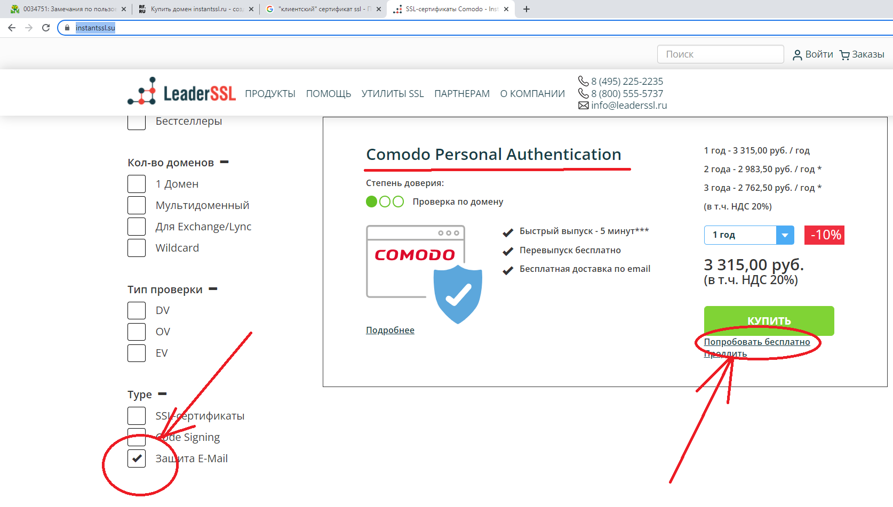

# Настройка IIS для поддержки клиентских сертификатов

Для обеспечения полноценного использования https может потребоваться сгенерировать самозаверенный сертификат:


В качестве альтернативы может быть использована утилита dev-cert, из состава Microsoft.NET Core:

``` shell
dotnet dev-cert https --trust
```

Далее следует создать web-сайт в IIS для которого в привязках установливается сгенерированный самозаверенный сертификат.

С помощью утилиты mmc из этого сертификата генерируется файл «cer» и добавляется в раздел «Доверенные корневые центры сертификации».

Для возможности отладки web-приложения в Visual Studio, в IDE следует добавлить профиль отладки «запуск в IIS». При запуске приложения на отладку, осуществляется подключение к web-сайту и публикация актуальной версии приложения. При запуске проекта Visual Studio переназначает папку web-сайта на папку проекта (именно по этой причине, Visual Studio должен быть запущен из под учётной записи администратора).

В настройках сайта в IIS, в разделе "проверка подлинности" в web-приложении IIS следует выключить все проверки подлинности (они не нужны, т.к. аутентификацию планируется осуществлять проверяя клиентский сертификат).

Сгенерированный инфраструктурой PKI клиентский сертификат может быть добавить для текущего пользователя в локальное хранилище сертификатов. Это позволит использовать подключение к серверу и браузеров Chrome и Edge.

В параметрах web-сайта «Параметры SSL» следует установить галку «Требовать SSL» и выбрать «Требовать – сертификат клиента».

В оснастке для работы с сертификатами (mmc, оснастка "Сертификаты") сертификат сгенерированный PKI (.pfx) следует экспортировать в pem, затем из pem должно быть извлечено тело сертификата (находится между BEGIN CERTIFICATE и END CERTIFICATE). Извлечённое тело нужно привести в одну строку и добавить в редакторе конфигураций в IIS в раздел «system.webServer/security/authentication/iisClientCertificateMappingAuthentication»:


Объединить строки сертификата в одну строку можно используя Notepad++. Следует вызвать окно "Поиск -> Замена... (Ctrl+H)" и ввести шаблон замены "\r\n".

Извлечённое тело сертификата нужно добавить в «oneToOneMappings»:


Внимание! Необходимо указывать userName и password. Эти параметры ассоциируются с пользователем операционной системы сертификат которого был предъявлен. Запуск пользовательской сессии выполняется под учётной записью этого пользователя.

Также может быть добавлен раздел "Rules", в котором указываются дополнительные параметры для проверки клиентского сертификата: Subject, Issuer, и т.д.

**Тестовая проверка**: запускаем браузер Edge/Chrome и пытаемся перейти на локальный web-сайт: https://ws-07654.dpr.msk.shq:8081/weatherforecast

Браузер отображает список доступных клиентских сертификатов в хранилище, состоящий из одного сертификата «Admin». Если его выбрать и ввести логин/пароль пользователя, то запрос проходит через IIS, динамически генерируется контент и отображается в браузере.

Тоже самое происходит и с Postman, но для этого случая нужно указать клиентский сертификат в «Settings -> Certificates»  (общие настройки Postman) для конкретного web-сайта.


**Ключевое замечание**: Если не указывать клиентский сертификат, или не ввести логин/пароль, то будет получен Http Status Code – 403.7 (Forbidden).

**UPDATE 2022**: Компания [LeaderSSL](https://www.instantssl.su/) выпускает сертификаты Sectigo/Comodo для пользователей из России за рубли. Можно выпустить сертификат на испытательный срок на 5-12 дней. Для задач КБ ДОРС (взаимная аутентификация клиента и сервера) мы использовали клиентский сертификат для проверки e-mail - он был встроен в BVSUpdate.



**UPDATE 2023**: при развертывании web-приложения на промышленном сервере (который находится в публичном сегменте интернета), необходимо обеспечить доступа с сервера к удостоверяющему центру для проверки, не попал ли клиентский сертификат в _Certificate Revocation List_ (CRL). Если такого доступа не будет, IIS посчитает клиентский сертфикат не доверенным и заблокирует доступ к сайту.

Также следует заметить, что если на странице «Параметры SSL -> Сертификаты клиента» установить флаг со значения «Принимать» на «Требовать», то попытка доступа к странице не требующей предъявления сертификата (обычно, это некоторая тестовая страница) перестаёт быть доступной (мы получаем Http Status Code **403 Forbidden**).

**UPDATE 2023**: при обновлении клиентского сертификата было установлено, что "oneToOneMapping", для конкретного случая - избыточный. При наличии возможности у сервера проверить сертификат, достаточно добавить проверку корректных атрибутов клиентского сертификата в web-приложении (см. вызовы методов **AddAuthentication** и **AddCertificate**) и этого достаточно для установления двухсторонней аутентификации. Учётная запись, под которой работает web-приложение, устанавливается в параметрах "Application Pools", в поле "Identity". Например, именем пользователя может быть ".\ruf_api".

## Создание полноценного стенда для тестирования

Для того, чтобы тестировать ПО с использованием сертификатов, в том числе клиентских сертификатов, крайне важно, чтобы запрос на сервер пришёл с использованием корректного сетевого имени, т.к. это сетевое имя обычно прописано в сертификате. Примером сетевого имени используемого в сертификате может быть "coconut.fresh.ru".

На практике, развернуть приложение на сайте "coconut.fresh.ru" сразу нельзя. Этот сайт может работать в промышленной эксплуатации и публикация изменённого приложения может быть выполнена только после выполнения полноценного тестирования.

Чтобы достичь целей тестирования, приложение размещается на тестовом сервере в сети, у которого есть статический IP-адрес (например, 192.168.1.51), но нет символического имени в DNS. Чтобы web-сервер получил символическое имя, может быть использована подход с изменением маршрутизации на клиентском компьютере. Для этого изменяется файл `hosts`, расположенный в Windows в папке "c:\Windows\System32\drivers\etc". В описываемой выше ситуации, в файл hosts следует внести следующую настройку:

```hosts
192.168.1.51        coconut.fresh.ru
```

После перезагрузки операционной системы, если в браузере указать адрес https://coconut.fresh.ru, запрос будет передан на порт 443 сервера 192.168.1.51. Сервер, по символическому имени сможет определить web-приложение, хостинг которого осуществляется на web-сервере, а так же будет использовать имя coconut.fresh.ru для проверки сертификатов.

Заметим, что использование разных символических имён позволяет вызывать разные web-приложения на одном физическом сервере. Например, настройки могут выглядеть следующим образом:

```hosts
192.168.1.51        coconut.fresh.ru
192.168.1.51        winners.sport.com
192.168.1.51        www.publicenemy.io
```
