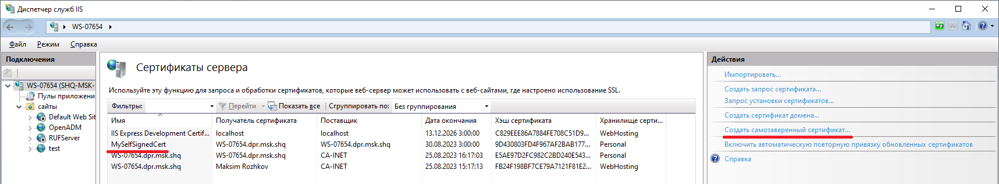
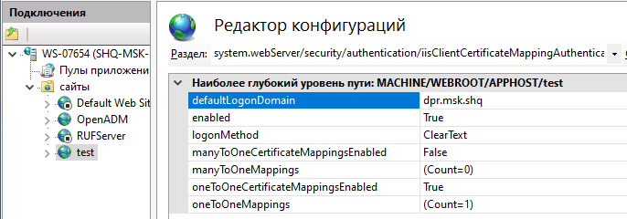
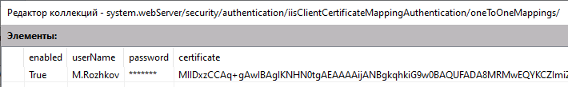
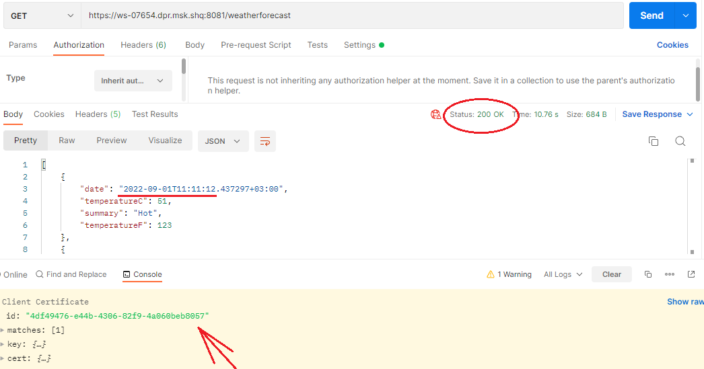

# Настройка IIS для поддержки клиентских сертификатов

Для обеспечения полноценного использования https может потребоваться сгенерировать самозаверенный сертификат:

Далее следует создать web-сайт в IIS для которого в привязках установливается сгенерированный самозаверенный сертификат.

С помощью утилиты mmc из этого сертификата генерируется файл «cer» и добавляется в раздел «Доверенные корневые центры сертификации».

Для возможности отладки web-приложения в Visual Studio, в IDE следует добавлить профиль отладки «запуск в IIS». При запуске приложения на отладку, осуществляется подключение к web-сайту и публикация актуальной версии приложения.

В настройках сайта в IIS, в разделе "проверка подлинности" в web-приложении IIS следует выключить все проверки подлинности (они не нужны, т.к. аутентификацию планируется осуществлять проверяя клиентский сертификат).

Сгенерированный инфраструктурой PKI клиентский сертификат может быть добавить для текущего пользователя в локальное хранилище сертификатов. Это позволит использовать подключение к серверу и браузеров Chrome и Edge.

В параметрах web-сайта «Параметры SSL» следует установить галку «Требовать SSL» и выбрать «Требовать – сертификат клиента».

В оснастке для работы с сертификатами (mmc, оснастка "Сертификаты") сертификат сгенерированный PKI (.pfx) следует экспортировать в pem, затем из pem должно быть извлечёно тело сертификата (находится между BEGIN CERTIFICATE и END CERTIFICATE). Извлечённое тело нужно привести в одну строку и добавить в редакторе конфигураций в IIS в раздел «system.webServer/security/authentication/iisClientCertificateMappingAuthentication»:

Извлечённое тело сертификата нужно добавить в «oneToOneMappings»:

Внимание! Необходимо указывать userName и password. Эти параметры ассоциируются с пользователем операционной системы сертификат которого был предъявлен. Запуск пользовательской сессии выполняется под учётной записью этого пользователя.

Также может быть добавлен раздел "Rules", в котором указываются дополнительные параметры для проверки клиентского сертификата: Subject, Issuer, и т.д.

**Тестовая проверка**: запускаем браузер Edge/Chrome и пытаемся перейти на локальный web-сайт: https://ws-07654.dpr.msk.shq:8081/weatherforecast

Браузер отображает список доступных клиентских сертификатов в хранилище, состоящий из одного сертификата «Admin». Если его выбрать и ввести логин/пароль пользователя, то запрос проходит через IIS, динамически генерируется контент и отображается в браузере.

Тоже самое происходит и с Postman, но для этого случая нужно указать клиентский сертификат в «Settings -> Certificates»  (общие настройки Postman) для конкретного web-сайта.

**Ключевое замечание**: Если не указывать клиентский сертификат, или не ввести логин/пароль, то будет получен Http Status Code – 403.7 (Forbidden).
