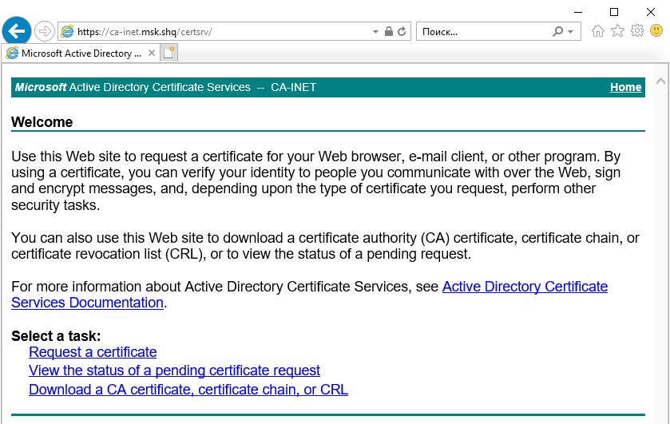
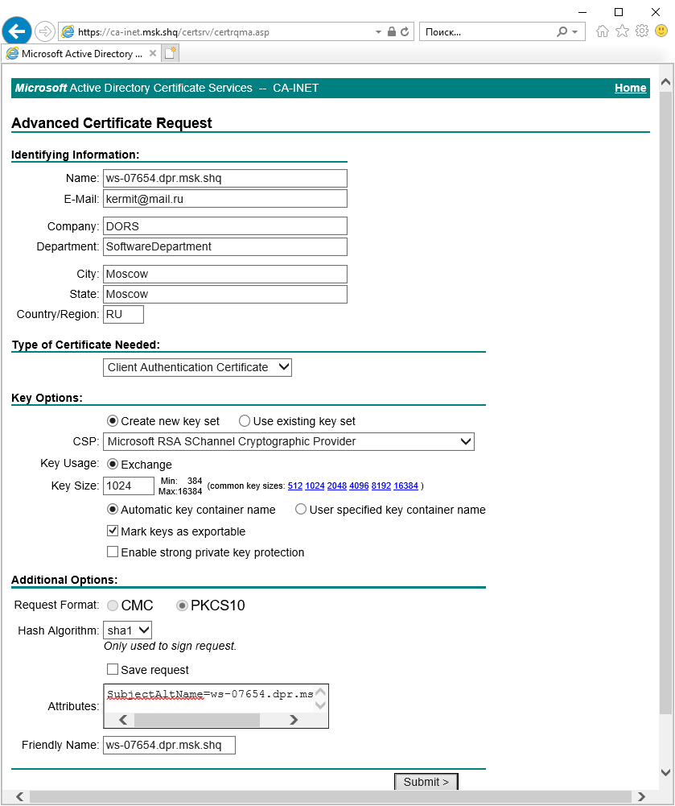

# Генерация сертификата в инфраструктуре PKI

В информационных системах предприятий генерация сертификатов с криптопарами ключей осуществляется через специализированный корпоративный портал.

Портал может быть построен на устаревших технологиях и, например, требовать браузера Internet Explorer, работающего в режиме совместимости. В ГК ДОРС ссылка на портал такая: https://ca-inet.msk.shq/certsrv/

Для генерации сертификата следует сформировать соответствующий запрос. Пример заполнения формы приведён ниже:

Ключевым полем является "Attributes", в котором можно явным образом указать дополнительные атрибуты сертификата, например: "SubjectAltName=ws-07654.dpr.msk.shq".

Администратор портала принимает решение о выпуске сертификата. Выпущенный сертификат можно скачать, либо сразу же установить в локальное хранилище сертификатов.

Ключевой операцией после установки, скачивания сертификата является проверка корректности его атрибутов.
